# Apple IIc USB/Bluetooth Keyboard Adapter
## Proposal for AY-3600 Replacement using ESP32-C3

---

## Executive Summary

Replace the Apple IIc's AY-3600-PRO-KEY keyboard encoder with a modern ESP32-C3 microcontroller to add USB and Bluetooth keyboard support while maintaining compatibility with the original keyboard.

**Total Cost:** ~$20
**Assembly Difficulty:** Easy (no SMD soldering required)
**Features:** USB keyboards, Bluetooth keyboards, optional WiFi features

---

## System Architecture

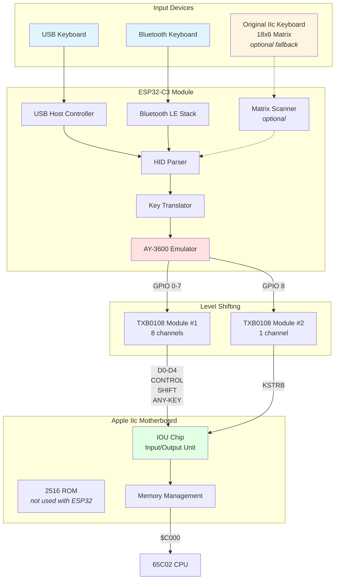

---

## Hardware Design

### Component Selection

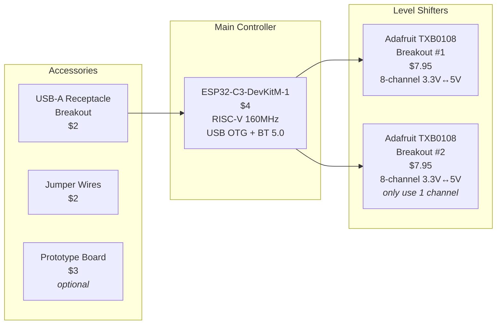

### Bill of Materials

| Component | Qty | Unit Price | Total | Source | Part Number |
|-----------|-----|------------|-------|--------|-------------|
| ESP32-C3-DevKitM-1 | 1 | $4.00 | $4.00 | AliExpress/Espressif | ESP32-C3-DevKitM-1 |
| Adafruit TXB0108 Breakout | 2 | $7.95 | $15.90 | Adafruit | #4245 |
| USB-A Breakout Board | 1 | $2.00 | $2.00 | Amazon/AliExpress | Generic |
| Jumper Wires M-F | 20 | $0.10 | $2.00 | Amazon | Generic |
| **TOTAL** | - | - | **$23.90** | - | - |

**Optional:**
- Prototype PCB: $3
- Header pins: $2
- Enclosure: $5-10

---

## Signal Interface

### AY-3600 Output Signals (to be emulated)

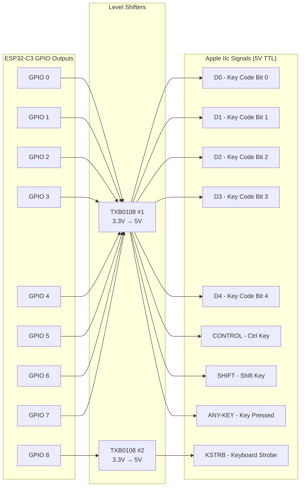

### Pin Assignment Table

| ESP32-C3 GPIO | Signal Name | Direction | Apple IIc Function | 5V Level |
|---------------|-------------|-----------|-------------------|----------|
| GPIO 0 | D0 | Output | Key code bit 0 | Yes (via LS) |
| GPIO 1 | D1 | Output | Key code bit 1 | Yes (via LS) |
| GPIO 2 | D2 | Output | Key code bit 2 | Yes (via LS) |
| GPIO 3 | D3 | Output | Key code bit 3 | Yes (via LS) |
| GPIO 4 | D4 | Output | Key code bit 4 | Yes (via LS) |
| GPIO 5 | CONTROL | Output | Control key state | Yes (via LS) |
| GPIO 6 | SHIFT | Output | Shift key state | Yes (via LS) |
| GPIO 7 | ANY-KEY | Output | Any key pressed flag | Yes (via LS) |
| GPIO 8 | KSTRB | Output | Keyboard strobe pulse | Yes (via LS) |
| GPIO 18 | USB D+ | I/O | USB Host (built-in) | 3.3V |
| GPIO 19 | USB D- | I/O | USB Host (built-in) | 3.3V |
| GPIO 10 | STATUS_LED | Output | Status indicator (optional) | 3.3V |

---

## Software Architecture

### Firmware Flow

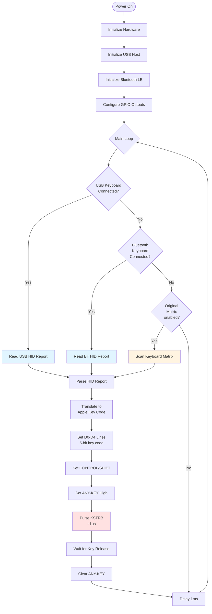

### Key Translation Example

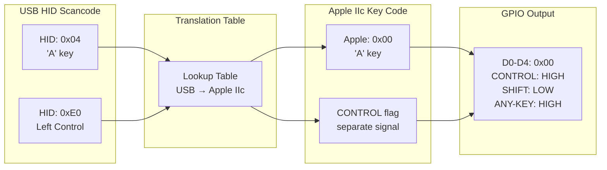

---

## Implementation Phases

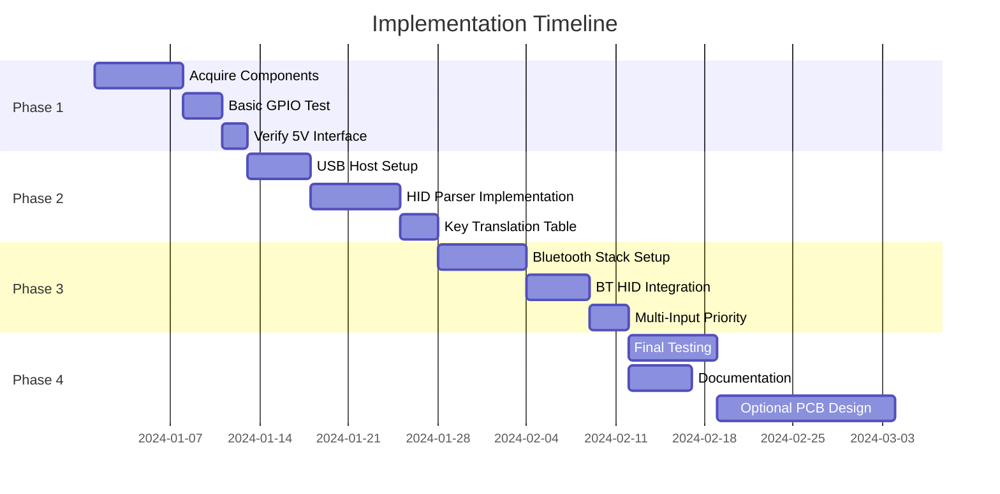

### Phase 1: Proof of Concept (Week 1-2)

**Goal:** Verify hardware interface works

**Tasks:**
1. Wire ESP32-C3 to TXB0108 level shifters
2. Connect level shifters to Apple IIc keyboard connector
3. Write test firmware to output fixed key codes
4. Verify Apple IIc reads keys correctly from $C000

**Success Criteria:**
- ESP32 can set D0-D4, CONTROL, SHIFT, ANY-KEY
- KSTRB pulse detected by IOU
- Reading $C000 returns expected key code

### Phase 2: USB Keyboard Support (Week 3-4)

**Goal:** Connect and use USB keyboards

**Tasks:**
1. Configure ESP-IDF USB Host stack
2. Enumerate USB HID keyboards
3. Parse USB HID reports
4. Build USB scancode → Apple IIc translation table
5. Test with multiple USB keyboards

**Success Criteria:**
- USB keyboard detected on plug-in
- All keys generate correct Apple IIc codes
- Modifier keys (Ctrl, Shift) work correctly
- Key repeat functions properly

### Phase 3: Bluetooth Support (Week 5-6)

**Goal:** Add wireless keyboard support

**Tasks:**
1. Initialize Bluetooth LE stack
2. Implement HID-over-GATT profile
3. Add pairing/bonding support
4. Parse Bluetooth HID reports
5. Test with multiple BT keyboards

**Success Criteria:**
- BT keyboard pairs successfully
- All keys work wirelessly
- Reconnection after power cycle works
- Both USB and BT keyboards can be switched

### Phase 4: Polish & Enhancement (Week 7-8)

**Goal:** Production-ready device

**Tasks:**
1. Add status LED indicators (USB/BT/error)
2. Implement configuration storage (key remapping)
3. Add WiFi config webpage (optional)
4. Create user documentation
5. Design permanent PCB (optional)

**Success Criteria:**
- Reliable operation over extended testing
- User-friendly status feedback
- Complete documentation
- Optional: Professional PCB design

---

## Physical Installation Options

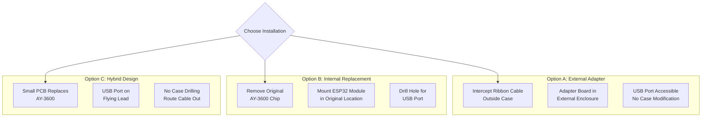

### Recommended: Option C (Hybrid)

**Advantages:**
- No permanent case modification
- Reversible installation
- Professional appearance
- USB port accessible through ventilation slots

**Implementation:**
1. Design PCB to match AY-3600 footprint (or use proto board)
2. Ribbon cable connects to original keyboard connector
3. USB port on 6-inch flying lead
4. Route cable through existing case openings
5. Use velcro/mounting tape to secure USB port

---

## Testing Procedures

### Hardware Validation Tests

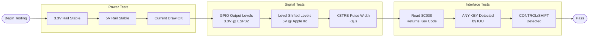

### Functional Tests

| Test Case | Expected Behavior | Pass/Fail |
|-----------|-------------------|-----------|
| USB keyboard plug-in | Detected within 2 seconds | ☐ |
| Type 'A' key | $C000 reads 0x00 (or correct code) | ☐ |
| Hold Shift + 'A' | SHIFT signal HIGH + 'A' code | ☐ |
| Hold Control + 'C' | CONTROL signal HIGH + 'C' code | ☐ |
| Key auto-repeat | Repeated key codes after 500ms | ☐ |
| BT keyboard pairing | Connects within 10 seconds | ☐ |
| BT keyboard typing | Same as USB keyboard | ☐ |
| Unplug USB keyboard | No spurious key events | ☐ |
| Power cycle | BT keyboard reconnects | ☐ |

---

## Cost Analysis

### Base Configuration (USB Only)

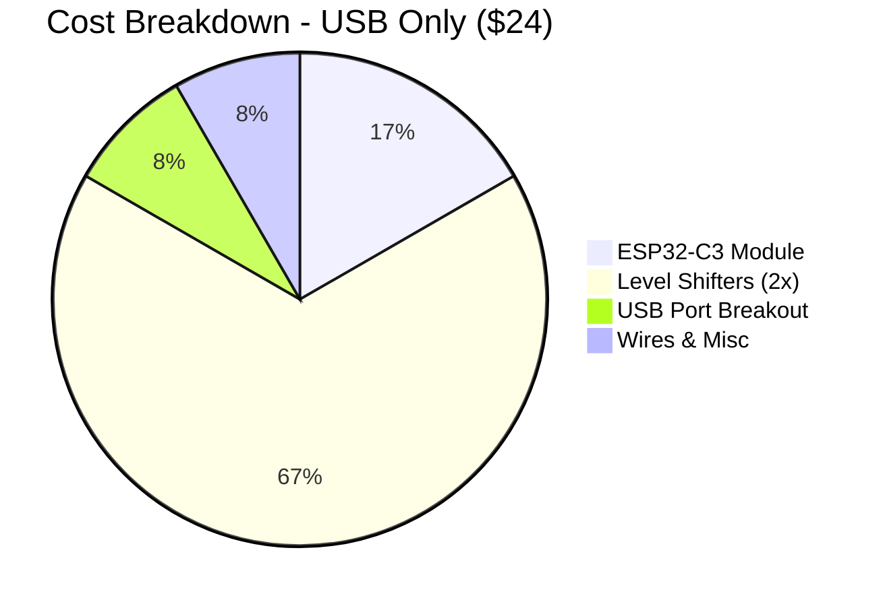

### Enhanced Configuration (USB + BT + PCB)

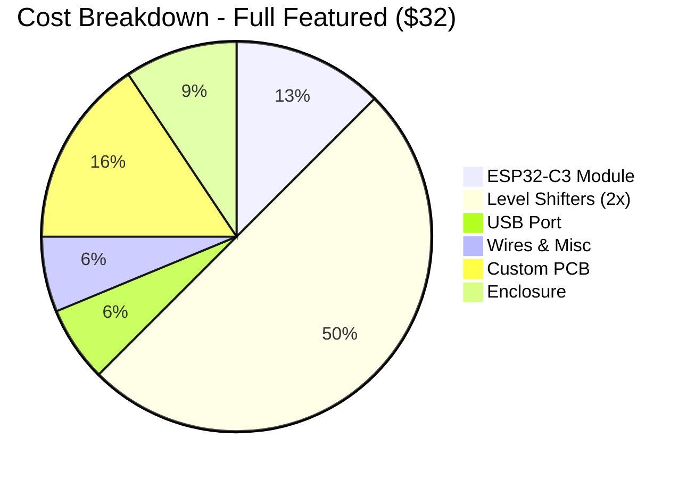

### Comparison vs. Alternatives

| Solution | Cost | USB | BT | Difficulty | Time |
|----------|------|-----|----|-----------||------|
| **This Project (Breadboard)** | $24 | ✅ | ✅ | Easy | 2 weeks |
| **This Project (PCB)** | $32 | ✅ | ✅ | Easy | 4 weeks |
| Original AY-3600 Repair | $50+ | ❌ | ❌ | Hard | N/A |
| Commercial USB Adapter | $80+ | ✅ | ❌ | N/A | N/A |
| Custom FPGA Solution | $100+ | ✅ | ❌ | Hard | 8 weeks |

---

## Risk Assessment & Mitigation

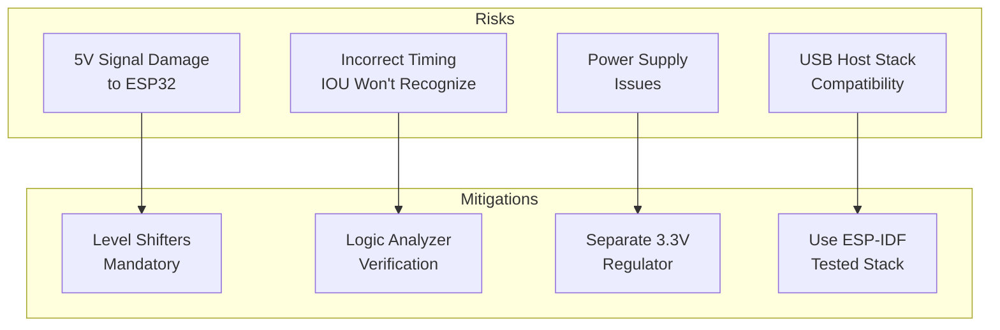

| Risk | Probability | Impact | Mitigation Strategy |
|------|-------------|--------|---------------------|
| Damage ESP32 with 5V | Medium | High | Always use level shifters; verify voltages before connecting |
| IOU doesn't detect signals | Medium | High | Use logic analyzer; match original AY-3600 timing precisely |
| Insufficient power | Low | Medium | Add dedicated 3.3V regulator; monitor current draw |
| USB keyboard incompatibility | Low | Low | Test with multiple keyboards; use proven TinyUSB/ESP-IDF stack |
| BT pairing problems | Medium | Low | Implement standard HID-over-GATT; test with multiple devices |
| Mechanical fit issues | Low | Low | Prototype on breadboard first; measure carefully before PCB |

---

## Future Enhancements

### Software Features (WiFi Enabled)

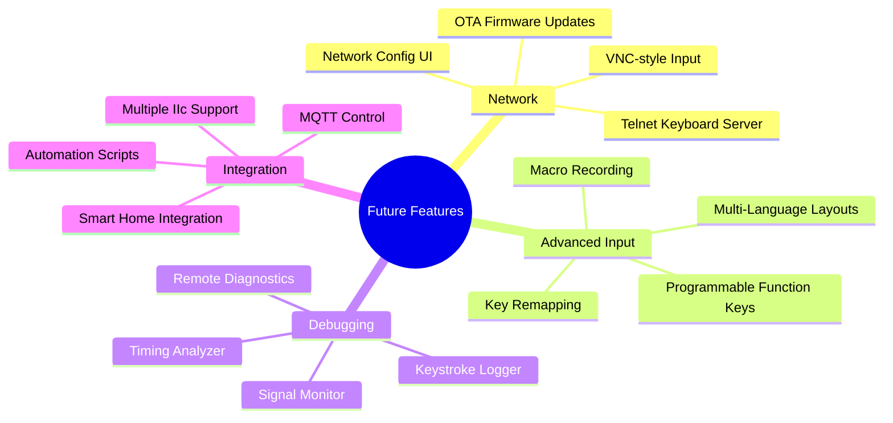

### Hardware Variants

1. **Budget Version** ($15)
   - Single TXB0104 (4-channel level shifter)
   - USB only (no Bluetooth)
   - ESP32-C3 clone module

2. **Premium Version** ($50)
   - Custom PCB with SMD components
   - Integrated level shifters
   - Professional enclosure
   - OLED status display
   - Multiple USB ports

3. **Universal Adapter** ($60)
   - Support multiple vintage computers
   - Selectable output protocols
   - DIP switches for configuration
   - Compatible with: Apple IIc, IIe, II+, Commodore 64, etc.

---

## Conclusion & Recommendation

### Why This Design?

✅ **Lazy-Friendly:** No SMD soldering required
✅ **Cost-Effective:** Under $25 for full USB+BT support
✅ **Future-Proof:** ESP32 ecosystem has long-term support
✅ **Expandable:** WiFi opens doors to advanced features
✅ **Reversible:** Doesn't permanently modify Apple IIc
✅ **Well-Documented:** ESP32 has huge community & examples

### Next Steps

1. **Order components** (links provided above)
2. **Start with Phase 1** (hardware validation)
3. **Iterate quickly** (breadboard allows rapid testing)
4. **Document findings** (help future retro enthusiasts!)

### Success Metrics

- ✅ USB keyboard works with Apple IIc
- ✅ Bluetooth keyboard works wirelessly
- ✅ All 63 keys properly translated
- ✅ Reliable operation for 100+ hours
- ✅ Total cost under $30

---

## Appendix A: Shopping Links

### Core Components

- **ESP32-C3-DevKitM-1:**
  - [Espressif Official Store (AliExpress)](https://www.aliexpress.com/item/1005003989099547.html)
  - Search: "ESP32-C3-DevKitM-1"

- **Adafruit TXB0108 Level Shifter:**
  - [Adafruit Product #4245](https://www.adafruit.com/product/4245)
  - Alternative: Search Amazon for "TXB0108 breakout"

- **USB-A Breakout:**
  - Search: "USB-A female breakout board"
  - [SparkFun USB-A Female Breakout](https://www.sparkfun.com/products/12700)

### Tools & Accessories

- **Logic Analyzer** (for debugging):
  - Saleae Logic 8 ($400) or cheap clones ($10)
- **Multimeter:** Any basic model
- **Soldering Iron:** For header pins (optional)
- **Breadboard:** 830 tie-points
- **Jumper Wires:** M-F and M-M assortment

---

## Appendix B: Reference Documents

- [ESP32-C3 Technical Reference Manual](https://www.espressif.com/sites/default/files/documentation/esp32-c3_technical_reference_manual_en.pdf)
- [Apple IIc Technical Reference Manual](https://archive.org/details/a2ctrm/Apple2cTechRef01) - Section 11.7 "The Keyboard"
- [USB HID Usage Tables](https://usb.org/sites/default/files/hut1_21_0.pdf)
- [TXB0108 Datasheet](https://www.ti.com/lit/ds/symlink/txb0108.pdf)

---

## Appendix C: Contact & Support

**Project Author:** [Your Name]
**Last Updated:** 2025-10-20
**License:** Open Source Hardware (OSHW)
**Repository:** [GitHub link when available]

For questions or contributions, please open an issue on GitHub or contact via email.

---

*End of Proposal*
